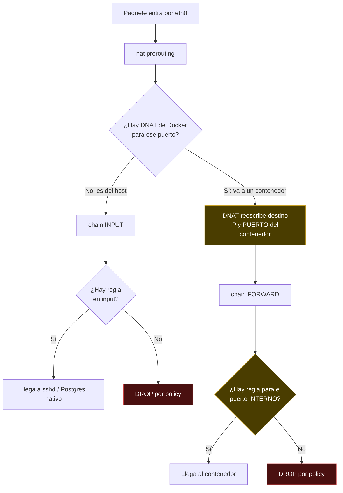
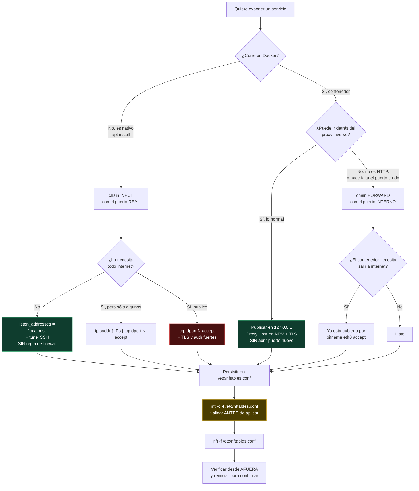
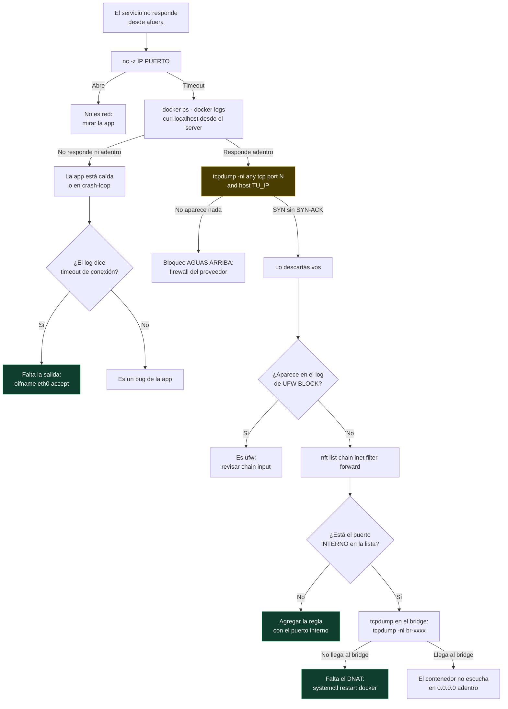
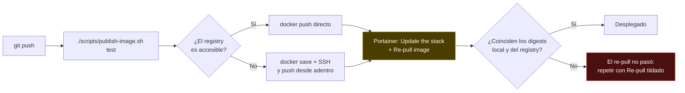

# Flujogramas de red y firewall

Tres diagramas: por dónde pasa un paquete, qué regla escribir para exponer algo,
y cómo diagnosticar cuando no llega. Complementan
[VPS-SETUP.md](VPS-SETUP.md).

---

## 1. Camino de un paquete entrante

Es el diagrama que explica por qué abrir un puerto "obvio" no funciona.



**Lo que hay que retener:** el DNAT ocurre **antes** de `forward`, así que para
`-p 8090:8080` la regla se escribe sobre el **8080**. Una regla con el 8090 no
matchea nunca.

---

## 2. Quiero exponer algo: ¿qué regla escribo?



El camino verde es el preferido: **nada nuevo abierto**. El rojo es el último
recurso.

---

## 3. No llega: cómo encontrar dónde muere

Cada paso descarta una capa. En orden, del más barato al más caro.



### El paso que más ahorra: el tcpdump

```bash
timeout 25 tcpdump -ni any tcp port 8090 and host $(curl -s ifconfig.me) -c 6
```

- **Nada** → el bloqueo está antes de tu máquina.
- **SYN repetidos sin respuesta** → llegan y los estás tirando vos.

Los tres casos reales de este proyecto salieron de acá:

| Síntoma | Causa | Arreglo |
| --- | --- | --- |
| Registry no aceptaba push | `forward` en policy drop sin reglas | `tcp dport 5000 accept` |
| API colgada en 8090 | la regla decía 8090, el DNAT ya lo había pasado a 8080 | `tcp dport 8080 accept` |
| API en crash-loop | los contenedores no podían salir | `oifname "eth0" accept` |
| Todo caído tras aplicar el firewall | `flush ruleset` borró el DNAT de Docker | `systemctl restart docker` y no volver a usar `flush ruleset` |

---

## 4. Publicar una versión nueva



Sin el **Re-pull image**, Portainer sigue corriendo la imagen vieja. Con la base
ya migrada, el código viejo falla con `errorMissingColumn` y todo devuelve 500.
